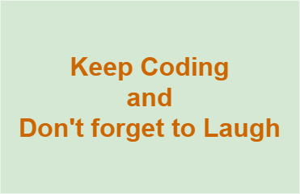

# Understanding "fua"

Some thoughts on [fua](../README.md)-underlying concepts, ideas and interpretations.

## Table of Content

- [Introduction](#introduction)
- [Internal View](#internal-view)
- [The Presentation Layer is Somewhere Else](#the-presentation-layer-is-somewhere-else)
- [Do NOT Cover](#do-not-cover)
- [fua exposes Namespaces](#fua-exposes-namespaces)
- [turtle and Linked Data](#turtle-and-linked-data)
- [Dirty Hands](#dirty-hands)
- [Deep Dive](#deep-dive)
    - [Understanding "Identifier"](#understanding-identifier)
    - [Understanding "Data and Information"](#understanding-data-and-information)
    - [Understanding "Action and Activity"](#understanding-action-and-activity)
    - [Understanding "Data Exchange"](#understanding-data-exchange)
- [Using fua](#using-fua)
- [Does Humor Belong to an Ontology or Data?](#does-humor-belong-to-an-ontology-or-data)
- [You are Welcome!](#you-are-welcome)

*"Understanding fua", Table of Content*.

## Introduction

---

## Internal View

[fua](../README.md) - as presented here - aims the _internal_ view on expressing data and its structure,
implementing solutions, done by [nicos](https:///www.nicos-ag.com) Research & Development (nrd), based on
[GAIAboX (`gbx`)](https://github.com/nicosResearchAndDevelopment/gbx/README.md) and brought to service by.

---

## The Mechanics

Understanding it this way, service users (like [Data Consumers](../glossary/README.md#data-consumer)) do **NOT** have to
implement [fua](../README.md)! Reading the docs here, means to get a deeper understanding of _the mechanics_ and offers
(and that seems to be the most significant impact) and to foster creativity of those intended to work with given
concepts.

---

## The Presentation Layer is Somewhere Else

[fua](../README.md) does **NOT** express information offered on the Presentation Layer, the information of interest send
to given [Data Consumer](../glossary/README.md#data-consumer). The Presentation Layer is _seated_ somewhere
else: [gbx](https://github.com/nicosResearchAndDevelopment/gbx/README.md) - whatever _THE_ presentation looks
like...

---

## Do **NOT** Cover

[fua](../README.md) aims **NOT** to cover well know concepts, ontologies and schemas, like (in alphabetical order):

| Prefix   | Specification                                                                                          |
|:---------|:-------------------------------------------------------------------------------------------------------|
| dct      | [DCMI Metadata Terms](https://www.dublincore.org/specifications/dublin-core/dcmi-terms/)               |
| foaf     | [Friend Of A Friend](http://xmlns.com/foaf/spec/)                                                      |
| odrl     | [ODRL Information Model 2.2](https://www.w3.org/TR/odrl-model/)                                        |
| org      | [The Organization Ontology](https://www.w3.org/TR/vocab-org/)                                          |
| prov     | [PROV Model Primer](https://www.w3.org/TR/prov-primer/)                                                |
| skos     | [SKOS Simple Knowledge Organization System](https://www.w3.org/TR/skos-reference/)                     |
| time     | [Time Ontology in OWL](https://www.w3.org/TR/owl-time/)                                                |
| vc       | [Verifiable Credentials Data Model v1.1](https://www.w3.org/TR/vc-data-model/)                         |
| xsd      | [W3C XML Schema Definition Language (XSD) 1.1 Part 2: Datatypes](https://www.w3.org/TR/xmlschema11-2/) |

...to list some of those [fua](../README.md) has a strong relation to.

---

## `fua` exposes Namespaces

[fua](../README.md) itself exposes some "Namespaces" (behaving as prefixes), like:

| Prefix | Specification                                 |
|:-------|:----------------------------------------------|
| flow   | [Workflow](../extension/flow/README.md)       |
| dave   | [DataVerse](../extension/dataverse/README.md) |
| narr   | [Narration](../extension/narration/README.md) |
| self   | [Self](../self/README.md)                     |

Under [_Decide_](../extension/decide/README.md) as [ODRL-profiles](https://www.w3.org/TR/odrl-model/#profile):

| Prefix | Specification                                                                                                       |
|:-------|:--------------------------------------------------------------------------------------------------------------------|
| ftime  | [Time](../extension/decide/profile/ftime/README.md)                                                                 |
|        | ...extending [Time Ontology in OWL](https://www.w3.org/TR/owl-time/)                                                |
| flow   | [Workflow](../extension/flow/README.md)                                                                             |
| dacl   | [Workflow](../extension/flow/README.md)                                                                             |
| tracl   | [Transformation, Translation, Transmutation and Conversion Language](../extension/decide/profile/tracl/README.md)  |

To get in touch with some problems from outer space:

| Prefix | Space                                                   |
|:-------|:--------------------------------------------------------|
| univ   | [Universe](../extension/universe/README.md)             |
| tuni   | [_The_ Universe](../example/theuniverse/README.md)      |
| puni   | [_Parallel_ Universe](../example/theuniverse/README.md) |

---

## turtle and Linked Data

[fua](../README.md) shows itself and its examples, all its citations (mostly) in
[turtle](../glossary/README.md#turtle). For some readers this seems _natural_. For others not. A lot of us don't like
this turtle-stuff. For this reason there are some concepts
(like ["Open Digital Rights Language", (ODRL)](../glossary/README.md#odrl)
or [vc](https://www.w3.org/TR/vc-data-model/)) out in the field showing topics in
[JSON-LD](https://www.w3.org/TR/json-ld11/). "LD" = [Linked Data](https://en.wikipedia.org/wiki/Linked_data).

Some of us are feeling more comfortable with JSON-LD, because it looks like [_JSON_](https://en.wikipedia.org/wiki/JSON)
("Yes", JSON-LD **is** JSON!!!) and [fua](../README.md) itself will present some concepts in JSON-LD
(see [fua "Decide Pofiles"](../extension/decide/profile/README.md), these are on top
on [ODRL](../glossary/README.md#odrl)
and so it seems to be "natural" to do so...), also - and/or in turtle. But [fua](../README.md) focuses on turtle
and it seems to be worth to learn it reading. Authors of [fua](../README.md) thought that it is the better way...

---

## Dirty Hands

To get hands dirty, [fua](../README.md) works with [examples](../èxample/README.md) to get in touch with
_"aha!" moments_ - at best. And to strength the intention of being the _solution_
and **NOT** the [_problem_](../glossary/README.md#problem-layer)...

- [The Weather Station](../èxample/theweatherstation/README.md)
- [The Elevator](../èxample/theelevator/README.md)
- [The Universe](../example/theuniverse/README.md)
- [The Universe Dataverse](../èxample/dataversetuni/README.md)

Sometimes some of those scopes look a little nerdy, but they only try to demonstrate and explain
underlying concepts of [fua](../README.md) - and trigger creativity of kind reader.

---

## Deep Dive

### Understanding "Identifier"

[Here](./identifier/).

### Understanding "Data and Information"

[Here](./data_and_information/).

### Understanding "Action and Activity"

Reaching out for executing [Workflows](../glossary/README.md#workflow)... [here](./action_and_activity/).

### Understanding "Data Exchange"

[Here](./dataexchange/).

---

## Using fua

`fuas` intention is **NOT** that someone has to work with it! Implementers are **NOT** advised to code on top of given
ontologies/schemata exposed here! Service Consumers, targeting on those services evolved
by [GAIAboX](https://www.gaiabox.eu)-family (see also: [GBX](./../gbx/README.md)), are confronted
with well know concepts and **NOT** (most of the time :-( ) with proprietary essentials...

But maybe someone finds it smart and decides to do so? Keep in mind: `fua` is **NOT**
a standard and exists because of its implementation done by [nicos](https://www.nios-ag.com/)!

---

## Does Humor Belong to an Ontology or Data?

The authors of [`foaf`](http://xmlns.com/foaf/spec/#term_dnaChecksum) had found an answer in 2014:

```turtle
foaf:dnaChecksum a rdf:Property, owl:DatatypeProperty;
    vs:term_status "archaic";
    rdfs:label "DNA checksum";
    rdfs:comment "A checksum for the DNA of some thing. Joke.";
    rdfs:isDefinedBy <http://xmlns.com/foaf/0.1/>;
    rdfs:range rdfs:Literal.
```

...saying "Yes, it does!" - and the authors of `fua` agree, [too](./../agent.ttl)!

[tfhs](../agent.ttl) says:



---

## You are Welcome!

So, if someone is interested in implementing its own solutions using [fua](../README.md) - you're welcome! For all
others it will (hopefully) be a manual to explore `fuas` potentials and its topping [services](../gbx/README.md).

---